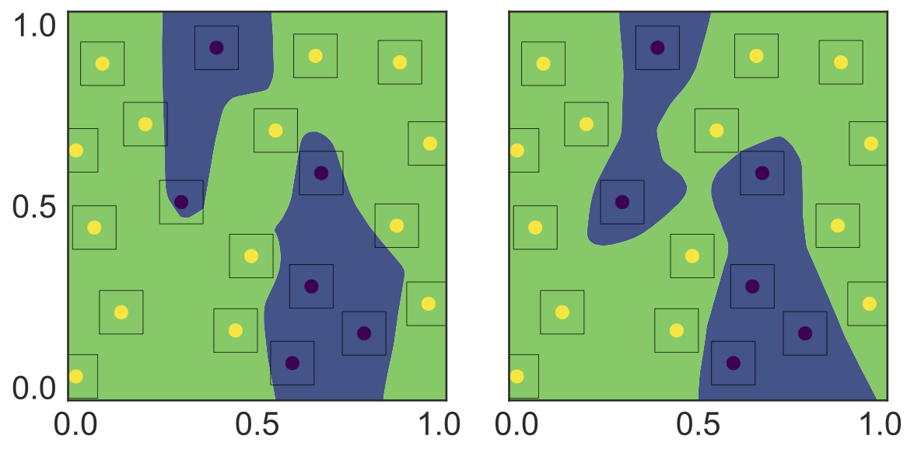
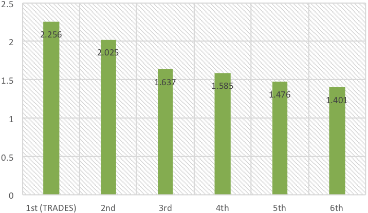
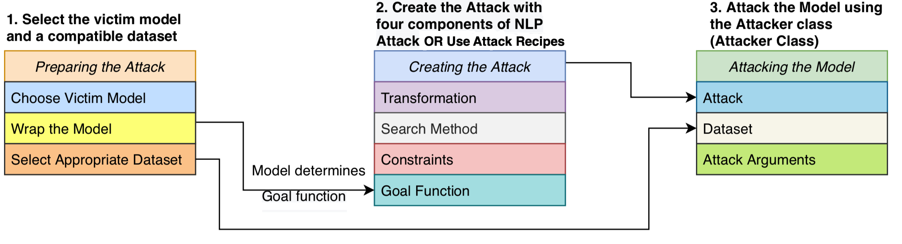

<<<<<<< HEAD
<<<<<<< HEAD
此代码仓库是为了学习，整合以下代码仓库中的代码：
https://github.com/yaodongyu/TRADES.git
=======
# TRADES (**TR**adeoff-inspired **A**dversarial **DE**fense via **S**urrogate-loss minimization) 

This is the official code for the [ICML'19 paper](https://arxiv.org/pdf/1901.08573.pdf) "Theoretically Principled Trade-off between Robustness and Accuracy" by [Hongyang Zhang](http://www.cs.cmu.edu/~hongyanz/) (CMU, TTIC), [Yaodong Yu](https://github.com/yaodongyu) (University of Virginia), Jiantao Jiao (UC Berkeley), Eric P. Xing (CMU & Petuum Inc.), Laurent El Ghaoui (UC Berkeley), and Michael I. Jordan (UC Berkeley).

The methodology is the first-place winner of the [NeurIPS 2018 Adversarial Vision Challenge (Robust Model Track)](https://www.crowdai.org/challenges/nips-2018-adversarial-vision-challenge-robust-model-track/leaderboards).

The attack method transferred from TRADES robust model is the first-place winner of the [NeurIPS 2018 Adversarial Vision Challenge (Targeted Attack Track)](https://www.crowdai.org/challenges/nips-2018-adversarial-vision-challenge-targeted-attack-track/leaderboards).

## Prerequisites
* Python (3.6.4)
* Pytorch (0.4.1)
* CUDA
* numpy

## Install
We suggest to install the dependencies using Anaconda or Miniconda. Here is an exemplary command:
```
$ wget https://repo.anaconda.com/archive/Anaconda3-5.1.0-Linux-x86_64.sh
$ bash Anaconda3-5.1.0-Linux-x86_64.sh
$ source ~/.bashrc
$ conda install pytorch=0.4.1
```


## TRADES: A New Loss Function for Adversarial Training

### What is TRADES?
TRADES minimizes a regularized surrogate loss L(.,.) (e.g., the cross-entropy loss) for adversarial training:
,Y)+\beta\max_{X'\in\mathbb{B}(X,\epsilon)}\mathcal{L}(f(X),f(X'))\right\\}.)

**Important: the surrogate loss L(.,.) in the second term should be classification-calibrated according to our theory, in contrast to the L2 loss used in [Adversarial Logit Pairing](https://arxiv.org/pdf/1803.06373.pdf).**

The first term encourages the natural error to be optimized by minimizing the "difference" between f(X) and Y , while the second regularization term encourages the output to be smooth, that is, it pushes the decision boundary of classifier away from the sample instances via minimizing the "difference" between the prediction of natural example f(X) and that of adversarial example f(X′). The tuning parameter β plays a critical role on balancing the importance of natural and robust errors.

<p align="center">
    
</p>
<p align="center">
<b>Left figure:</b> decision boundary by natural training. <b>Right figure:</b> decision boundary by TRADES.
</p>


## How to use TRADES to train robust models?

### Natural training:
```python
def train(args, model, device, train_loader, optimizer, epoch):
    model.train()
    for batch_idx, (data, target) in enumerate(train_loader):
        data, target = data.to(device), target.to(device)
        optimizer.zero_grad()
        loss = F.cross_entropy(model(data), target)
        loss.backward()
        optimizer.step()
```
### Adversarial training by TRADES:
To apply TRADES, cd into the directory, put 'trades.py' to the directory. Replace ```F.cross_entropy()``` above with ```trades_loss()```:
```python
from trades import trades_loss

def train(args, model, device, train_loader, optimizer, epoch):
    model.train()
    for batch_idx, (data, target) in enumerate(train_loader):
        data, target = data.to(device), target.to(device)
        optimizer.zero_grad()
        # calculate robust loss - TRADES loss
        loss = trades_loss(model=model,
                           x_natural=data,
                           y=target,
                           optimizer=optimizer,
                           step_size=args.step_size,
                           epsilon=args.epsilon,
                           perturb_steps=args.num_steps,
                           beta=args.beta,
			   distance='l_inf')
        loss.backward()
        optimizer.step()
```
#### Arguments:
* ```step_size```: step size for perturbation
* ```epsilon```: limit on the perturbation size
* ```num_steps```: number of perturbation iterations for projected gradient descent (PGD)
* ```beta```: trade-off regularization parameter
* ```distance```: type of perturbation distance, ```'l_inf'``` or ```'l_2'```

The trade-off regularization parameter ```beta``` can be set in ```[1, 10]```. Larger ```beta``` leads to more robust and less accurate models.

### Basic MNIST example (adversarial training by TRADES):
```python
python mnist_example_trades.py
```
We adapt ```main.py``` in [[link]](https://github.com/pytorch/examples/tree/master/mnist) to our new loss ```trades_loss()``` during training.


## Running demos

### Adversarial training:

* Train WideResNet-34-10 model on CIFAR10:
```bash
  $ python train_trades_cifar10.py
```

* Train CNN model (four convolutional layers + three fully-connected layers) on MNIST:
```bash
  $ python train_trades_mnist.py
```

* Train CNN model (two convolutional layers + two fully-connected layers) on MNIST (digits '1' and '3') for binary classification problem:
```bash
  $ python train_trades_mnist_binary.py
```

### Robustness evaluation:

* Evaluate robust WideResNet-34-10 model on CIFAR10 by FGSM-20 attack:
```bash
  $ python pgd_attack_cifar10.py
```

* Evaluate robust CNN model on MNIST by FGSM-40 attack:
```bash
  $ python pgd_attack_mnist.py
```


## Experimental results
### Results in the NeurIPS 2018 Adversarial Vision Challenge [[link]](https://www.crowdai.org/challenges/nips-2018-adversarial-vision-challenge-robust-model-track/leaderboards)
TRADES won the 1st place out of 1,995 submissions in the NeurIPS 2018 Adversarial Vision Challenge (Robust Model Track) on the Tiny ImageNet dataset, surpassing the runner-up approach by 11.41% in terms of L2 perturbation distance.
<p align="center">
    
</p>
<p align="center">
Top-6 results (out of 1,995 submissions) in the NeurIPS 2018 Adversarial Vision Challenge (Robust Model Track). The vertical axis represents the mean L2 perturbation distance that makes robust models fail to output correct labels.
</p>

  
### Certified robustness [[code]](https://github.com/hongyanz/TRADES-smoothing)
TRADES + Random Smoothing achieves SOTA **certified** robustness in  norm at radius 2/255.
* Results on certified  robustness at radius 2/255 on CIFAR-10:

| Method              	| Robust Accuracy  	| Natural Accuracy |
|-----------------------|-----------------------|------------------|
| TRADES + Random Smoothing   		|  62.6%   	|   78.7%    		|
| [Salman et al. (2019)](https://arxiv.org/pdf/1906.04584.pdf)   		|  60.8%   	|   82.1%    		|
| [Zhang et al. (2020)](https://arxiv.org/pdf/1906.06316.pdf)   		|  54.0%   	|   72.0%    		|
| [Wong et al. (2018)](https://arxiv.org/pdf/1805.12514.pdf)   		|  53.9%   	|   68.3%    		|
| [Mirman et al. (2018)](http://proceedings.mlr.press/v80/mirman18b/mirman18b.pdf)   		|  52.2%   	|   62.0%    		|
| [Gowal et al. (2018)](https://arxiv.org/pdf/1810.12715.pdf)   		|  50.0%   	|   70.2%    		|
| [Xiao et al. (2019)](https://arxiv.org/pdf/1809.03008.pdf)   		|  45.9%   	|   61.1%    		|
  

## Want to attack TRADES? No problem!

TRADES is a new baseline method for adversarial defenses. We welcome various attack methods to attack our defense models. We provide checkpoints of our robust models on MNIST dataset and CIFAR dataset. On both datasets, we normalize all the images to ```[0, 1]```.

### How to download our CNN checkpoint for MNIST and WRN-34-10 checkpoint for CIFAR10?
```bash
cd TRADES
mkdir checkpoints
cd checkpoints
```
Then download our pre-trained model

[[download link]](https://drive.google.com/file/d/10sHvaXhTNZGz618QmD5gSOAjO3rMzV33/view?usp=sharing) (CIFAR10)

[[download link]](https://drive.google.com/file/d/1scTd9-YO3-5Ul3q5SJuRrTNX__LYLD_M/view?usp=sharing) (MNIST)

and put them into the folder "checkpoints".

### How to download MNIST dataset and CIFAR10 dataset?
```bash
cd TRADES
mkdir data_attack
cd data_attack
```

Then download the MNIST and CIFAR10 datasets

[[download link]](https://drive.google.com/file/d/1PXePa721gTvmQ46bZogqNGkW31Vu6u3J/view?usp=sharing) (CIFAR10_X)

[[download link]](https://drive.google.com/file/d/1znICoQ8Ds9MH-1yhNssDs3hgBpvx57PV/view?usp=sharing) (CIFAR10_Y)

[[download link]](https://drive.google.com/file/d/12aWmoNs3EMwYe_Z5pBidx_22xj-5IqDU/view?usp=sharing) (MNIST_X)

[[download link]](https://drive.google.com/file/d/1kCBlNfg2TRn8BlqCkNTJiPDgsxIliQgZ/view?usp=sharing) (MNIST_Y)

and put them into the folder "data_attack".


### About the datasets

All the images in both datasets are normalized to ```[0, 1]```.

* ```cifar10_X.npy``` 	-- a ```(10,000, 32, 32, 3)``` numpy array
* ```cifar10_Y.npy``` 	-- a ```(10,000, )``` numpy array
* ```mnist_X.npy``` 	-- a ```(10,000, 28, 28)``` numpy array
* ```mnist_Y.npy``` 	-- a ```(10,000, )``` numpy array

### Load our CNN model for MNIST
```python
from models.small_cnn import SmallCNN

device = torch.device("cuda")
model = SmallCNN().to(device)
model.load_state_dict(torch.load('./checkpoints/model_mnist_smallcnn.pt'))
```
For our model ```model_mnist_smallcnn.pt```, the limit on the perturbation size is ```epsilon=0.3``` (L_infinity perturbation distance).

#### White-box leaderboard
|Rank | Attack              	| Submitted by  	| Natural Accuracy | Robust Accuracy | Time |
|-----------------------|-----------------------|-----------------------|------------------|-----------------|-----------------|
|1| ITA | Hong Lei | 99.48% | 92.46% | Aug 27, 2021 |
|2| [EWR-PGD](https://github.com/liuye6666/EWR-PGD)  	|  Ye Liu (second entry) 	|   99.48%  		|    92.47%   	| Dec 20, 2020
|3| [EWR-PGD](https://github.com/liuye6666/EWR-PGD)  	|  Ye Liu  	|   99.48%  		|    92.52%    	| Sep 9, 2020
|4|[Square Attack](https://arxiv.org/abs/1912.00049)		| Andriushchenko Maksym	|   99.48%		|     92.58%	    | Mar 10, 2020
|5| [fab-attack](https://github.com/fra31/fab-attack)   		|  Francesco Croce   	|   99.48%    		|     93.33%    	| Jun 7, 2019
|6| FGSM-1,000   		|  (initial entry)  	|     99.48%       |     95.60%      | -
|7| FGSM-40   		|  (initial entry)   	|     99.48%       |     96.07%      | -

#### How to attack our CNN model on MNIST?
* Step 1: Download ```mnist_X.npy``` and ```mnist_Y.npy```.
* Step 2: Run your own attack on ```mnist_X.npy``` and save your adversarial images as ```mnist_X_adv.npy```.
* Step 3: put ```mnist_X_adv.npy``` under ```./data_attack```.
* Step 4: run the evaluation code,
```bash
  $ python evaluate_attack_mnist.py
```
Note that the adversarial images should in ```[0, 1]``` and the largest perturbation distance is ```epsilon = 0.3```(L_infinity).


### Load our WideResNet (WRN-34-10) model for CIFAR10
```python
from models.wideresnet import WideResNet

device = torch.device("cuda")
model = WideResNet().to(device)
model.load_state_dict(torch.load('./checkpoints/model_cifar_wrn.pt'))
```
For our model ```model_cifar_wrn.pt```, the limit on the perturbation size is ```epsilon=0.031``` (L_infinity perturbation distance).

#### White-box leaderboard

| Rank      | Attack               	| Submitted by  	| Natural Accuracy 	| Robust Accuracy  	| Time	|
|-----------------------|-----------------------|-----------------------|-----------------------|-----------------------|-----------------------|
|1| [EWR-PGD](https://github.com/liuye6666/EWR-PGD)  	|  Ye Liu (second entry)   	|   84.92%    		|    52.92%    	| Dec 20, 2020
|2| [CAA](https://arxiv.org/abs/2012.05434)  	|  Xiaofeng Mao  	|   84.92%    		|    52.94%    	| Dec 14, 2020
|3| [EWR-PGD](https://github.com/liuye6666/EWR-PGD)  	|  Ye Liu  	|   84.92%    		|    52.95%    	| Sep 9, 2020
|4| [ODI-PGD](https://arxiv.org/abs/2003.06878)  	|  Yusuke Tashiro  	|   84.92%    		|     53.01%    	| Feb 16, 2020
|5| [MultiTargeted](https://arxiv.org/abs/1910.09338)   	|  Sven Gowal   	|   84.92%    		|     53.07%    	| Oct 31, 2019
|6| [AutoAttack](https://github.com/fra31/auto-attack)   	|  (initial entry)   	|   84.92%    		|     53.08%    	| -
|7| [fab-attack](https://github.com/fra31/fab-attack)   		|  Francesco Croce   	|   84.92%    		|     53.44%    	| Jun 7, 2019
|8| ITA | Hong Lei | 84.92% | 53.85% | Aug 27, 2021 |
|9| FGSM-1,000   		|  (initial entry)   	|   84.92%    		|     56.43%    	| -
|10| FGSM-20   		|  (initial entry)   	|   84.92%    		|     56.61%    	| -
|11| MI-FGSM	   	|  (initial entry)   	|   84.92%    		|     57.95%    	| -
|12| FGSM 		   	|  (initial entry)   	|   84.92%    		|     61.06%    	| -
|13| DeepFool (L_inf)   	|  (initial entry)   	|   84.92%    		|     61.38%    	| -
|14| CW 		   	|  (initial entry)   	|   84.92%    		|     81.24%    	| -
|15| DeepFool (L_2)   	|  (initial entry)   	|   84.92%    		|     81.55%    	| -
|16| LBFGSAttack   	|  (initial entry)   	|   84.92%    		|     81.58%    	| -

#### How to attack our WRM-34-10 model on CIFAR10?
* Step 1: Download ```cifar10_X.npy``` and ```cifar10_Y.npy```.
* Step 2: Run your own attack on ```cifar10_X.npy``` and save your adversarial images as ```cifar10_X_adv.npy```.
* Step 3: put ```cifar10_X_adv.npy``` under ```./data_attack```.
* Step 4: run the evaluation code,
```bash
  $ python evaluate_attack_cifar10.py
```
Note that the adversarial images should be in ```[0, 1]``` and the largest perturbation distance is ```epsilon = 0.031```(L_infinity).


## Reference
For technical details and full experimental results, please check [the paper](https://arxiv.org/pdf/1901.08573.pdf).
```
@inproceedings{zhang2019theoretically, 
	author = {Hongyang Zhang and Yaodong Yu and Jiantao Jiao and Eric P. Xing and Laurent El Ghaoui and Michael I. Jordan}, 
	title = {Theoretically Principled Trade-off between Robustness and Accuracy}, 
	booktitle = {International Conference on Machine Learning},
	year = {2019}
}
```

## Contact
Please contact yyu@eecs.berkeley.edu and hongyang.zhang@uwaterloo.ca if you have any question on the codes. Enjoy!
>>>>>>> TRADES/master
=======
<h1 align="center">TextAttack 🐙</h1>

<p align="center">Generating adversarial examples for NLP models</p>

<p align="center">
  <a href="https://textattack.readthedocs.io/">[TextAttack Documentation on ReadTheDocs]</a>
  <br> <br>
  <a href="#about">About</a> •
  <a href="#setup">Setup</a> •
  <a href="#usage">Usage</a> •
  <a href="#design">Design</a>
  <br> <br>
  <a target="_blank">
    
  </a>
  <a href="https://badge.fury.io/py/textattack">
    
  </a>
</p>


## About

TextAttack is a Python framework for adversarial attacks, data augmentation, and model training in NLP.

> If you're looking for information about TextAttack's menagerie of pre-trained models, you might want the [TextAttack Model Zoo](https://textattack.readthedocs.io/en/latest/3recipes/models.html) page.

## Slack Channel

For help and realtime updates related to TextAttack, please [join the TextAttack Slack](https://join.slack.com/t/textattack/shared_invite/zt-huomtd9z-KqdHBPPu2rOP~Z8q3~urgg)!

### *Why TextAttack?*

There are lots of reasons to use TextAttack:

1. **Understand NLP models better** by running different adversarial attacks on them and examining the output
2. **Research and develop different NLP adversarial attacks** using the TextAttack framework and library of components
3. **Augment your dataset** to increase model generalization and robustness downstream
3. **Train NLP models** using just a single command (all downloads included!)

## Setup

### Installation

You should be running Python 3.6+ to use this package. A CUDA-compatible GPU is optional but will greatly improve code speed. TextAttack is available through pip:

```bash
pip install textattack
```

Once TextAttack is installed, you can run it via command-line (`textattack ...`)
or via python module (`python -m textattack ...`).

> **Tip**: TextAttack downloads files to `~/.cache/textattack/` by default. This includes pretrained models,
> dataset samples, and the configuration file `config.yaml`. To change the cache path, set the
> environment variable `TA_CACHE_DIR`. (for example: `TA_CACHE_DIR=/tmp/ textattack attack ...`).

## Usage

### Help: `textattack --help`

TextAttack's main features can all be accessed via the `textattack` command. Two very
common commands are `textattack attack <args>`, and `textattack augment <args>`. You can see more
information about all commands using
```bash
textattack --help
```
or a specific command using, for example,
```bash
textattack attack --help
```

The [`examples/`](examples/) folder includes scripts showing common TextAttack usage for training models, running attacks, and augmenting a CSV file.


The [documentation website](https://textattack.readthedocs.io/en/latest) contains walkthroughs explaining basic usage of TextAttack, including building a custom transformation and a custom constraint..


### Running Attacks: `textattack attack --help`

The easiest way to try out an attack is via the command-line interface, `textattack attack`.

> **Tip:** If your machine has multiple GPUs, you can distribute the attack across them using the `--parallel` option. For some attacks, this can really help performance. (If you want to attack Keras models in parallel, please check out `examples/attack/attack_keras_parallel.py` instead)

Here are some concrete examples:

*TextFooler on BERT trained on the MR sentiment classification dataset*:
```bash
textattack attack --recipe textfooler --model bert-base-uncased-mr --num-examples 100
```

*DeepWordBug on DistilBERT trained on the Quora Question Pairs paraphrase identification dataset*:
```bash
textattack attack --model distilbert-base-uncased-cola --recipe deepwordbug --num-examples 100
```

*Beam search with beam width 4 and word embedding transformation and untargeted goal function on an LSTM*:
```bash
textattack attack --model lstm-mr --num-examples 20 \
 --search-method beam-search^beam_width=4 --transformation word-swap-embedding \
 --constraints repeat stopword max-words-perturbed^max_num_words=2 embedding^min_cos_sim=0.8 part-of-speech \
 --goal-function untargeted-classification
```

> **Tip:** Instead of specifying a dataset and number of examples, you can pass `--interactive` to attack samples inputted by the user.

### Attacks and Papers Implemented ("Attack Recipes"): `textattack attack --recipe [recipe_name]`

We include attack recipes which implement attacks from the literature. You can list attack recipes using `textattack list attack-recipes`.

To run an attack recipe: `textattack attack --recipe [recipe_name]`



<table  style="width:100%" border="1">
<thead>
<tr class="header">
<th><strong>Attack Recipe Name</strong></th>
<th><strong>Goal Function</strong></th>
<th><strong>ConstraintsEnforced</strong></th>
<th><strong>Transformation</strong></th>
<th><strong>Search Method</strong></th>
<th><strong>Main Idea</strong></th>
</tr>
</thead>
<tbody>
  <tr><td style="text-align: center;" colspan="6"><strong><br>Attacks on classification tasks, like sentiment classification and entailment:<br></strong></td></tr>

<tr>
<td><code>a2t</code>
<span class="citation" data-cites="yoo2021a2t"></span></td>
<td><sub>Untargeted {Classification, Entailment}</sub></td>
<td><sub>Percentage of words perturbed, Word embedding distance, DistilBERT sentence encoding cosine similarity, part-of-speech consistency</sub></td>
<td><sub>Counter-fitted word embedding swap (or) BERT Masked Token Prediction</sub></td>
<td><sub>Greedy-WIR (gradient)</sub></td>
<td ><sub>from (["Towards Improving Adversarial Training of NLP Models" (Yoo et al., 2021)](https://arxiv.org/abs/2109.00544))</sub></td>
</tr>
<tr>
<td><code>alzantot</code>  <span class="citation" data-cites="Alzantot2018GeneratingNL Jia2019CertifiedRT"></span></td>
<td><sub>Untargeted {Classification, Entailment}</sub></td>
<td><sub>Percentage of words perturbed, Language Model perplexity, Word embedding distance</sub></td>
<td><sub>Counter-fitted word embedding swap</sub></td>
<td><sub>Genetic Algorithm</sub></td>
<td ><sub>from (["Generating Natural Language Adversarial Examples" (Alzantot et al., 2018)](https://arxiv.org/abs/1804.07998))</sub></td>
</tr>
<tr>
<td><code>bae</code> <span class="citation" data-cites="garg2020bae"></span></td>
<td><sub>Untargeted Classification</sub></td>
<td><sub>USE sentence encoding cosine similarity</sub></td>
<td><sub>BERT Masked Token Prediction</sub></td>
<td><sub>Greedy-WIR</sub></td>
<td ><sub>BERT masked language model transformation attack from (["BAE: BERT-based Adversarial Examples for Text Classification" (Garg & Ramakrishnan, 2019)](https://arxiv.org/abs/2004.01970)). </td>
</tr>
<tr>
<td><code>bert-attack</code> <span class="citation" data-cites="li2020bertattack"></span></td>
<td><sub>Untargeted Classification</td>
<td><sub>USE sentence encoding cosine similarity, Maximum number of words perturbed</td>
<td><sub>BERT Masked Token Prediction (with subword expansion)</td>
<td><sub>Greedy-WIR</sub></td>
<td ><sub> (["BERT-ATTACK: Adversarial Attack Against BERT Using BERT" (Li et al., 2020)](https://arxiv.org/abs/2004.09984))</sub></td>
</tr>
<tr>
<td><code>checklist</code> <span class="citation" data-cites="Gao2018BlackBoxGO"></span></td>
<td><sub>{Untargeted, Targeted} Classification</sub></td>
<td><sub>checklist distance</sub></td>
<td><sub>contract, extend, and substitutes name entities</sub></td>
<td><sub>Greedy-WIR</sub></td>
<td ><sub>Invariance testing implemented in CheckList . (["Beyond Accuracy: Behavioral Testing of NLP models with CheckList" (Ribeiro et al., 2020)](https://arxiv.org/abs/2005.04118))</sub></td>
</tr>
<tr>
<td> <code>clare</code> <span class="citation" data-cites="Alzantot2018GeneratingNL Jia2019CertifiedRT"></span></td>
<td><sub>Untargeted {Classification, Entailment}</sub></td>
<td><sub>USE sentence encoding cosine similarity</sub></td>
<td><sub>RoBERTa Masked Prediction for token swap, insert and merge</sub></td>
<td><sub>Greedy</sub></td>
<td ><sub>["Contextualized Perturbation for Textual Adversarial Attack" (Li et al., 2020)](https://arxiv.org/abs/2009.07502))</sub></td>
</tr>
<tr>
<td><code>deepwordbug</code> <span class="citation" data-cites="Gao2018BlackBoxGO"></span></td>
<td><sub>{Untargeted, Targeted} Classification</sub></td>
<td><sub>Levenshtein edit distance</sub></td>
<td><sub>{Character Insertion, Character Deletion, Neighboring Character Swap, Character Substitution}</sub></td>
<td><sub>Greedy-WIR</sub></td>
<td ><sub>Greedy replace-1 scoring and multi-transformation character-swap attack (["Black-box Generation of Adversarial Text Sequences to Evade Deep Learning Classifiers" (Gao et al., 2018)](https://arxiv.org/abs/1801.04354)</sub></td>
</tr>
<tr>
<td> <code>faster-alzantot</code> <span class="citation" data-cites="Alzantot2018GeneratingNL Jia2019CertifiedRT"></span></td>
<td><sub>Untargeted {Classification, Entailment}</sub></td>
<td><sub>Percentage of words perturbed, Language Model perplexity, Word embedding distance</sub></td>
<td><sub>Counter-fitted word embedding swap</sub></td>
<td><sub>Genetic Algorithm</sub></td>
<td ><sub>Modified, faster version of the Alzantot et al. genetic algorithm, from (["Certified Robustness to Adversarial Word Substitutions" (Jia et al., 2019)](https://arxiv.org/abs/1909.00986))</sub></td>
</tr>
<tr>
<td><code>hotflip</code> (word swap) <span class="citation" data-cites="Ebrahimi2017HotFlipWA"></span></td>
<td><sub>Untargeted Classification</sub></td>
<td><sub>Word Embedding Cosine Similarity, Part-of-speech match, Number of words perturbed</sub></td>
<td><sub>Gradient-Based Word Swap</sub></td>
<td><sub>Beam search</sub></td>
<td ><sub> (["HotFlip: White-Box Adversarial Examples for Text Classification" (Ebrahimi et al., 2017)](https://arxiv.org/abs/1712.06751))</sub></td>
</tr>
<tr>
<td><code>iga</code> <span class="citation" data-cites="iga-wang2019natural"></span></td>
<td><sub>Untargeted {Classification, Entailment}</sub></td>
<td><sub>Percentage of words perturbed, Word embedding distance</sub></td>
<td><sub>Counter-fitted word embedding swap</sub></td>
<td><sub>Genetic Algorithm</sub></td>
<td ><sub>Improved genetic algorithm -based word substitution from (["Natural Language Adversarial Attacks and Defenses in Word Level (Wang et al., 2019)"](https://arxiv.org/abs/1909.06723)</sub></td>
</tr>
<tr>
<td><code>input-reduction</code> <span class="citation" data-cites="feng2018pathologies"></span></td>
<td><sub>Input Reduction</sub></td>
<td></td>
<td><sub>Word deletion</sub></td>
<td><sub>Greedy-WIR</sub></td>
<td ><sub>Greedy attack with word importance ranking , Reducing the input while maintaining the prediction through word importance ranking (["Pathologies of Neural Models Make Interpretation Difficult" (Feng et al., 2018)](https://arxiv.org/pdf/1804.07781.pdf))</sub></td>
</tr>
<tr>
<td><code>kuleshov</code> <span class="citation" data-cites="Kuleshov2018AdversarialEF"></span></td>
<td><sub>Untargeted Classification</sub></td>
<td><sub>Thought vector encoding cosine similarity, Language model similarity probability</sub></td>
<td><sub>Counter-fitted word embedding swap</sub></td>
<td><sub>Greedy word swap</sub></td>
<td ><sub>(["Adversarial Examples for Natural Language Classification Problems" (Kuleshov et al., 2018)](https://openreview.net/pdf?id=r1QZ3zbAZ)) </sub></td>
</tr>
<tr>
<td><code>pruthi</code> <span class="citation" data-cites="pruthi2019combating"></span></td>
<td><sub>Untargeted Classification</sub></td>
<td><sub>Minimum word length, Maximum number of words perturbed</sub></td>
<td><sub>{Neighboring Character Swap, Character Deletion, Character Insertion, Keyboard-Based Character Swap}</sub></td>
<td><sub>Greedy search</sub></td>
<td ><sub>simulates common typos (["Combating Adversarial Misspellings with Robust Word Recognition" (Pruthi et al., 2019)](https://arxiv.org/abs/1905.11268) </sub></td>
</tr>
<tr>
<td><code>pso</code> <span class="citation" data-cites="pso-zang-etal-2020-word"></span></td>
<td><sub>Untargeted Classification</sub></td>
<td></td>
<td><sub>HowNet Word Swap</sub></td>
<td><sub>Particle Swarm Optimization</sub></td>
<td ><sub>(["Word-level Textual Adversarial Attacking as Combinatorial Optimization" (Zang et al., 2020)](https://www.aclweb.org/anthology/2020.acl-main.540/)) </sub></td>
</tr>
<tr>
<td><code>pwws</code> <span class="citation" data-cites="pwws-ren-etal-2019-generating"></span></td>
<td><sub>Untargeted Classification</sub></td>
<td></td>
<td><sub>WordNet-based synonym swap</sub></td>
<td><sub>Greedy-WIR (saliency)</sub></td>
<td ><sub>Greedy attack with word importance ranking based on word saliency and synonym swap scores (["Generating Natural Language Adversarial Examples through Probability Weighted Word Saliency" (Ren et al., 2019)](https://www.aclweb.org/anthology/P19-1103/))</sub> </td>
</tr>
<tr>
<td><code>textbugger</code> : (black-box) <span class="citation" data-cites="Li2019TextBuggerGA"></span></td>
<td><sub>Untargeted Classification</sub></td>
<td><sub>USE sentence encoding cosine similarity</sub></td>
<td><sub>{Character Insertion, Character Deletion, Neighboring Character Swap, Character Substitution}</sub></td>
<td><sub>Greedy-WIR</sub></td>
<td ><sub>([(["TextBugger: Generating Adversarial Text Against Real-world Applications" (Li et al., 2018)](https://arxiv.org/abs/1812.05271)).</sub></td>
</tr>
<tr>
<td><code>textfooler</code> <span class="citation" data-cites="Jin2019TextFooler"></span></td>
<td><sub>Untargeted {Classification, Entailment}</sub></td>
<td><sub>Word Embedding Distance, Part-of-speech match, USE sentence encoding cosine similarity</sub></td>
<td><sub>Counter-fitted word embedding swap</sub></td>
<td><sub>Greedy-WIR</sub></td>
<td ><sub>Greedy attack with word importance ranking  (["Is Bert Really Robust?" (Jin et al., 2019)](https://arxiv.org/abs/1907.11932))</sub> </td>
</tr>

<tr><td style="text-align: center;" colspan="6"><strong><br>Attacks on sequence-to-sequence models: <br></strong></td></tr>

<tr>
<td><code>morpheus</code> <span class="citation" data-cites="morpheus-tan-etal-2020-morphin"></span></td>
<td><sub>Minimum BLEU Score</sub> </td>
<td></td>
<td><sub>Inflection Word Swap</sub> </td>
<td><sub>Greedy search</sub> </td>
<td ><sub>Greedy to replace words with their inflections with the goal of minimizing BLEU score (["It’s Morphin’ Time! Combating Linguistic Discrimination with Inflectional Perturbations"](https://www.aclweb.org/anthology/2020.acl-main.263.pdf)</sub> </td>
</tr>

</tr>
<tr>
<td><code>seq2sick</code> :(black-box) <span class="citation" data-cites="cheng2018seq2sick"></span></td>
<td><sub>Non-overlapping output</sub> </td>
<td></td>
<td><sub>Counter-fitted word embedding swap</sub> </td>
<td><sub>Greedy-WIR</sub></td>
<td ><sub>Greedy attack with goal of changing every word in the output translation. Currently implemented as black-box with plans to change to white-box as done in paper (["Seq2Sick: Evaluating the Robustness of Sequence-to-Sequence Models with Adversarial Examples" (Cheng et al., 2018)](https://arxiv.org/abs/1803.01128)) </sub>  </td>
</tr>


</tbody>
</font>
</table>


#### Recipe Usage Examples

Here are some examples of testing attacks from the literature from the command-line:

*TextFooler against BERT fine-tuned on SST-2:*
```bash
textattack attack --model bert-base-uncased-sst2 --recipe textfooler --num-examples 10
```

*seq2sick (black-box) against T5 fine-tuned for English-German translation:*
```bash
 textattack attack --model t5-en-de --recipe seq2sick --num-examples 100
```

### Augmenting Text: `textattack augment`

Many of the components of TextAttack are useful for data augmentation. The `textattack.Augmenter` class
uses a transformation and a list of constraints to augment data. We also offer  built-in recipes
for data augmentation:
- `wordnet` augments text by replacing words with WordNet synonyms
- `embedding` augments text by replacing words with neighbors in the counter-fitted embedding space, with a constraint to ensure their cosine similarity is at least 0.8
- `charswap` augments text by substituting, deleting, inserting, and swapping adjacent characters
- `eda` augments text with a combination of word insertions, substitutions and deletions.
- `checklist` augments text by contraction/extension and by substituting names, locations, numbers.
- `clare` augments text by replacing, inserting, and merging with a pre-trained masked language model.
- `back_trans` augments text by backtranslation approach.
- `back_transcription` augments text by back transcription approach.


#### Augmentation Command-Line Interface
The easiest way to use our data augmentation tools is with `textattack augment <args>`. `textattack augment`
takes an input CSV file and text column to augment, along with the number of words to change per augmentation
and the number of augmentations per input example. It outputs a CSV in the same format with all the augmentation
examples corresponding to the proper columns.

For example, given the following as `examples.csv`:

```csv
"text",label
"the rock is destined to be the 21st century's new conan and that he's going to make a splash even greater than arnold schwarzenegger , jean- claud van damme or steven segal.", 1
"the gorgeously elaborate continuation of 'the lord of the rings' trilogy is so huge that a column of words cannot adequately describe co-writer/director peter jackson's expanded vision of j . r . r . tolkien's middle-earth .", 1
"take care of my cat offers a refreshingly different slice of asian cinema .", 1
"a technically well-made suspenser . . . but its abrupt drop in iq points as it races to the finish line proves simply too discouraging to let slide .", 0
"it's a mystery how the movie could be released in this condition .", 0
```

The command
```bash
textattack augment --input-csv examples.csv --output-csv output.csv  --input-column text --recipe embedding --pct-words-to-swap .1 --transformations-per-example 2 --exclude-original
```
will augment the `text` column by altering 10% of each example's words, generating twice as many augmentations as original inputs, and exclude the original inputs from the
output CSV. (All of this will be saved to `augment.csv` by default.)

> **Tip:** Just as running attacks interactively, you can also pass `--interactive` to augment samples inputted by the user to quickly try out different augmentation recipes!


After augmentation, here are the contents of `augment.csv`:
```csv
text,label
"the rock is destined to be the 21st century's newest conan and that he's gonna to make a splashing even stronger than arnold schwarzenegger , jean- claud van damme or steven segal.",1
"the rock is destined to be the 21tk century's novel conan and that he's going to make a splat even greater than arnold schwarzenegger , jean- claud van damme or stevens segal.",1
the gorgeously elaborate continuation of 'the lord of the rings' trilogy is so huge that a column of expression significant adequately describe co-writer/director pedro jackson's expanded vision of j . rs . r . tolkien's middle-earth .,1
the gorgeously elaborate continuation of 'the lordy of the piercings' trilogy is so huge that a column of mots cannot adequately describe co-novelist/director peter jackson's expanded vision of j . r . r . tolkien's middle-earth .,1
take care of my cat offerings a pleasantly several slice of asia cinema .,1
taking care of my cat offers a pleasantly different slice of asiatic kino .,1
a technically good-made suspenser . . . but its abrupt drop in iq points as it races to the finish bloodline proves straightforward too disheartening to let slide .,0
a technically well-made suspenser . . . but its abrupt drop in iq dot as it races to the finish line demonstrates simply too disheartening to leave slide .,0
it's a enigma how the film wo be releases in this condition .,0
it's a enigma how the filmmaking wo be publicized in this condition .,0
```

The 'embedding' augmentation recipe uses counterfitted embedding nearest-neighbors to augment data.

#### Augmentation Python Interface
In addition to the command-line interface, you can augment text dynamically by importing the
`Augmenter` in your own code. All `Augmenter` objects implement `augment` and `augment_many` to generate augmentations
of a string or a list of strings. Here's an example of how to use the `EmbeddingAugmenter` in a python script:

```python
>>> from textattack.augmentation import EmbeddingAugmenter
>>> augmenter = EmbeddingAugmenter()
>>> s = 'What I cannot create, I do not understand.'
>>> augmenter.augment(s)
['What I notable create, I do not understand.', 'What I significant create, I do not understand.', 'What I cannot engender, I do not understand.', 'What I cannot creating, I do not understand.', 'What I cannot creations, I do not understand.', 'What I cannot create, I do not comprehend.', 'What I cannot create, I do not fathom.', 'What I cannot create, I do not understanding.', 'What I cannot create, I do not understands.', 'What I cannot create, I do not understood.', 'What I cannot create, I do not realise.']
```
You can also create your own augmenter from scratch by importing transformations/constraints from `textattack.transformations` and `textattack.constraints`. Here's an example that generates augmentations of a string using `WordSwapRandomCharacterDeletion`:

```python
>>> from textattack.transformations import WordSwapRandomCharacterDeletion
>>> from textattack.transformations import CompositeTransformation
>>> from textattack.augmentation import Augmenter
>>> transformation = CompositeTransformation([WordSwapRandomCharacterDeletion()])
>>> augmenter = Augmenter(transformation=transformation, transformations_per_example=5)
>>> s = 'What I cannot create, I do not understand.'
>>> augmenter.augment(s)
['What I cannot creae, I do not understand.', 'What I cannot creat, I do not understand.', 'What I cannot create, I do not nderstand.', 'What I cannot create, I do nt understand.', 'Wht I cannot create, I do not understand.']
```

#### Prompt Augmentation
In additional to augmentation of regular text, you can augment prompts and then generate responses to 
the augmented prompts using a large language model (LLMs). The augmentation is performed using the same
`Augmenter` as above. To generate responses, you can use your own LLM, a HuggingFace LLM, or an OpenAI LLM.
Here's an example using a pretrained HuggingFace LLM: 

```python
>>> from textattack.augmentation import EmbeddingAugmenter
>>> from transformers import AutoModelForSeq2SeqLM, AutoTokenizer
>>> from textattack.llms import HuggingFaceLLMWrapper
>>> from textattack.prompt_augmentation import PromptAugmentationPipeline
>>> augmenter = EmbeddingAugmenter(transformations_per_example=3)
>>> model = AutoModelForSeq2SeqLM.from_pretrained("google/flan-t5-small")
>>> tokenizer = AutoTokenizer.from_pretrained("google/flan-t5-small")
>>> model_wrapper = HuggingFaceLLMWrapper(model, tokenizer)
>>> pipeline = PromptAugmentationPipeline(augmenter, model_wrapper)
>>> pipeline("Classify the following piece of text as `positive` or `negative`: This movie is great!")
[('Classify the following piece of text as `positive` or `negative`: This film is great!', ['positive']), ('Classify the following piece of text as `positive` or `negative`: This movie is fabulous!', ['positive']), ('Classify the following piece of text as `positive` or `negative`: This movie is wonderful!', ['positive'])]
```


### Training Models:  `textattack train`

Our model training code is available via `textattack train` to help you train LSTMs,
CNNs, and `transformers` models using TextAttack out-of-the-box. Datasets are
automatically loaded using the `datasets` package.

#### Training Examples
*Train our default LSTM for 50 epochs on the Yelp Polarity dataset:*
```bash
textattack train --model-name-or-path lstm --dataset yelp_polarity  --epochs 50 --learning-rate 1e-5
```


*Fine-Tune `bert-base` on the `CoLA` dataset for 5 epochs**:
```bash
textattack train --model-name-or-path bert-base-uncased --dataset glue^cola --per-device-train-batch-size 8 --epochs 5
```


### To check datasets: `textattack peek-dataset`

To take a closer look at a dataset, use `textattack peek-dataset`. TextAttack will print some cursory statistics about the inputs and outputs from the dataset. For example,
```bash
textattack peek-dataset --dataset-from-huggingface snli
```
will show information about the SNLI dataset from the NLP package.


### To list functional components: `textattack list`

There are lots of pieces in TextAttack, and it can be difficult to keep track of all of them. You can use `textattack list` to list components, for example, pretrained models (`textattack list models`) or available search methods (`textattack list search-methods`).


## Design


### Models

TextAttack is model-agnostic!  You can use `TextAttack` to analyze any model that outputs IDs, tensors, or strings. To help users, TextAttack includes pre-trained models for different common NLP tasks. This makes it easier for
users to get started with TextAttack. It also enables a more fair comparison of attacks from
the literature.


#### Built-in Models and Datasets

TextAttack also comes built-in with models and datasets. Our command-line interface will automatically match the correct
dataset to the correct model. We include 82 different (Oct 2020) pre-trained models for each of the nine [GLUE](https://gluebenchmark.com/)
tasks, as well as some common datasets for classification, translation, and summarization.

A list of available pretrained models and their validation accuracies is available at
[textattack/models/README.md](textattack/models/README.md). You can also view a full list of provided models
& datasets via `textattack attack --help`.

Here's an example of using one of the built-in models (the SST-2 dataset is automatically loaded):

```bash
textattack attack --model roberta-base-sst2 --recipe textfooler --num-examples 10
```

#### HuggingFace support: `transformers` models and `datasets` datasets

We also provide built-in support for [`transformers` pretrained models](https://huggingface.co/models)
and datasets from the [`datasets` package](https://github.com/huggingface/datasets)! Here's an example of loading
and attacking a pre-trained model and dataset:

```bash
textattack attack --model-from-huggingface distilbert-base-uncased-finetuned-sst-2-english --dataset-from-huggingface glue^sst2 --recipe deepwordbug --num-examples 10
```

You can explore other pre-trained models using the `--model-from-huggingface` argument, or other datasets by changing
`--dataset-from-huggingface`.


#### Loading a model or dataset from a file

You can easily try out an attack on a local model or dataset sample. To attack a pre-trained model,
create a short file that loads them as variables `model` and `tokenizer`.  The `tokenizer` must
be able to transform string inputs to lists or tensors of IDs using a method called `encode()`. The
model must take inputs via the `__call__` method.

##### Custom Model from a file
To experiment with a model you've trained, you could create the following file
and name it `my_model.py`:

```python
model = load_your_model_with_custom_code() # replace this line with your model loading code
tokenizer = load_your_tokenizer_with_custom_code() # replace this line with your tokenizer loading code
```

Then, run an attack with the argument `--model-from-file my_model.py`. The model and tokenizer will be loaded automatically.


### Custom Datasets


#### Dataset from a file

Loading a dataset from a file is very similar to loading a model from a file. A 'dataset' is any iterable of `(input, output)` pairs.
The following example would load a sentiment classification dataset from file `my_dataset.py`:

```python
dataset = [('Today was....', 1), ('This movie is...', 0), ...]
```

You can then run attacks on samples from this dataset by adding the argument `--dataset-from-file my_dataset.py`.


#### Dataset loading via other mechanism, see: [more details at here](https://textattack.readthedocs.io/en/latest/api/datasets.html)

```python
import textattack
my_dataset = [("text",label),....]
new_dataset = textattack.datasets.Dataset(my_dataset)
```


#### Dataset via AttackedText class

To allow for word replacement after a sequence has been tokenized, we include an `AttackedText` object
which maintains both a list of tokens and the original text, with punctuation. We use this object in favor of a list of words or just raw text.


### Attacks and how to design a new attack


We formulate an attack as consisting of four components: a **goal function** which determines if the attack has succeeded, **constraints** defining which perturbations are valid, a **transformation** that generates potential modifications given an input, and a **search method** which traverses through the search space of possible perturbations. The attack attempts to perturb an input text such that the model output fulfills the goal function (i.e., indicating whether the attack is successful) and the perturbation adheres to the set of constraints (e.g., grammar constraint, semantic similarity constraint). A search method is used to find a sequence of transformations that produce a successful adversarial example.


This modular design unifies adversarial attack methods into one system, enables us to easily assemble attacks from the literature while re-using components that are shared across attacks. We provides clean, readable implementations of 16 adversarial attack recipes from the literature (see above table). For the first time, these attacks can be benchmarked, compared, and analyzed in a standardized setting.


TextAttack is model-agnostic - meaning it can run attacks on models implemented in any deep learning framework. Model objects must be able to take a string (or list of strings) and return an output that can be processed by the goal function. For example, machine translation models take a list of strings as input and produce a list of strings as output. Classification and entailment models return an array of scores. As long as the user's model meets this specification, the model is fit to use with TextAttack.


#### Goal Functions

A `GoalFunction` takes as input an `AttackedText` object, scores it, and determines whether the attack has succeeded, returning a `GoalFunctionResult`.

#### Constraints

A `Constraint` takes as input a current `AttackedText`, and a list of transformed `AttackedText`s. For each transformed option, it returns a boolean representing whether the constraint is met.

#### Transformations

A `Transformation` takes as input an `AttackedText` and returns a list of possible transformed `AttackedText`s. For example, a transformation might return all possible synonym replacements.

#### Search Methods

A `SearchMethod` takes as input an initial `GoalFunctionResult` and returns a final `GoalFunctionResult` The search is given access to the `get_transformations` function, which takes as input an `AttackedText` object and outputs a list of possible transformations filtered by meeting all of the attack’s constraints. A search consists of successive calls to `get_transformations` until the search succeeds (determined using `get_goal_results`) or is exhausted.


## On Benchmarking Attacks

- See our analysis paper: Searching for a Search Method: Benchmarking Search Algorithms for Generating NLP Adversarial Examples at [EMNLP BlackBoxNLP](https://arxiv.org/abs/2009.06368).

- As we emphasized in the above paper, we don't recommend to directly compare Attack Recipes out of the box.

- This comment is due to that attack recipes in the recent literature used different ways or thresholds in setting up their constraints. Without the constraint space held constant, an increase in attack success rate could come from an improved search or transformation method or a less restrictive search space.

- Our Github on benchmarking scripts and results:  [TextAttack-Search-Benchmark Github](https://github.com/QData/TextAttack-Search-Benchmark)


## On Quality of Generated Adversarial Examples in Natural Language

- Our analysis Paper in [EMNLP Findings](https://arxiv.org/abs/2004.14174)
- We analyze the generated adversarial examples of two state-of-the-art synonym substitution attacks. We find that their perturbations often do not preserve semantics, and 38% introduce grammatical errors. Human surveys reveal that to successfully preserve semantics, we need to significantly increase the minimum cosine similarities between the embeddings of swapped words and between the sentence encodings of original and perturbed sentences.With constraints adjusted to better preserve semantics and grammaticality, the attack success rate drops by over 70 percentage points.
- Our Github on Reevaluation results: [Reevaluating-NLP-Adversarial-Examples Github](https://github.com/QData/Reevaluating-NLP-Adversarial-Examples)
- As we have emphasized in this analysis paper, we recommend researchers and users to be EXTREMELY mindful on the quality of generated adversarial examples in natural language
- We recommend the field to use human-evaluation derived thresholds for setting up constraints


## Multi-lingual Support


- see example code: [https://github.com/QData/TextAttack/blob/master/examples/attack/attack_camembert.py](https://github.com/QData/TextAttack/blob/master/examples/attack/attack_camembert.py) for using our framework to attack French-BERT.

- see tutorial notebook: [https://textattack.readthedocs.io/en/latest/2notebook/Example_4_CamemBERT.html](https://textattack.readthedocs.io/en/latest/2notebook/Example_4_CamemBERT.html) for using our framework to attack French-BERT.

- See [README_ZH.md](https://github.com/QData/TextAttack/blob/master/README_ZH.md) for our README in Chinese


## Contributing to TextAttack

We welcome suggestions and contributions! Submit an issue or pull request and we will do our best to respond in a timely manner. TextAttack is currently in an "alpha" stage in which we are working to improve its capabilities and design.

See [CONTRIBUTING.md](https://github.com/QData/TextAttack/blob/master/CONTRIBUTING.md) for detailed information on contributing.

## Citing TextAttack

If you use TextAttack for your research, please cite [TextAttack: A Framework for Adversarial Attacks, Data Augmentation, and Adversarial Training in NLP](https://arxiv.org/abs/2005.05909).

```bibtex
@inproceedings{morris2020textattack,
  title={TextAttack: A Framework for Adversarial Attacks, Data Augmentation, and Adversarial Training in NLP},
  author={Morris, John and Lifland, Eli and Yoo, Jin Yong and Grigsby, Jake and Jin, Di and Qi, Yanjun},
  booktitle={Proceedings of the 2020 Conference on Empirical Methods in Natural Language Processing: System Demonstrations},
  pages={119--126},
  year={2020}
}
```
>>>>>>> TextAttack/master
